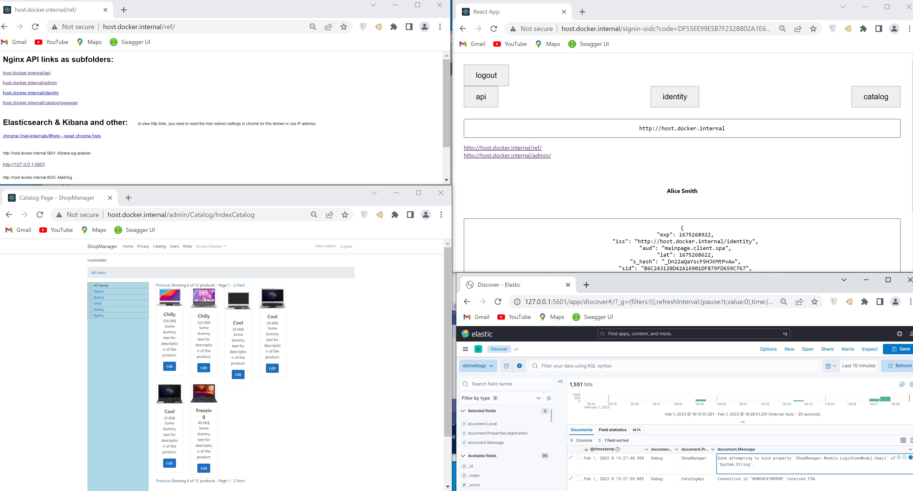

# IdentityServer4 AspNetCore React Docker application

this is a sample development environment for microservice application

## Used technologies/tools:
- IdentityServer4
- C# 10.0 with ASP.NET CORE 7.0 
- create-react-app with typescript
- Nginx proxy
- GitLab CI/CD
- PostgreSQL DB
- Powershell


## Start project localy
for Windows
```
./start.ps1

or

cd src
docker-compose -f docker-compose.misc.yml up -d
docker-compose --env-file ./.env.win up
docker-compose -f docker-compose.elk.yml up -d
```

For Linux
```
cd src
docker-compose -f docker-compose.misc.yml up -d
docker-compose --env-file ./.env.linux -f docker-compose.yml -f docker-compose.override.yml up
docker-compose -f docker-compose.elk.yml up -d
```
## Project URL
http://host.docker.internal

http://host.docker.internal/ref

<p align="center">
  
</p>

## GitLab CI/CD compose files in folder ./deployment/.GitLabCI/
Build machine: https://docker.neva.loc

## reset chrome cahe
```
chrome://net-internals/#hsts
chrome:restart
```

Check Self signet certificate for domain
```
cd deployment/TestSSL
docker-compose --env-file ./.env_linux -f docker-compose.sslnginx.yml up
```

## Build frontend only
```
docker-compose --env-file ./.env.win build --force-rm --no-cache --progress plain frontend
```
